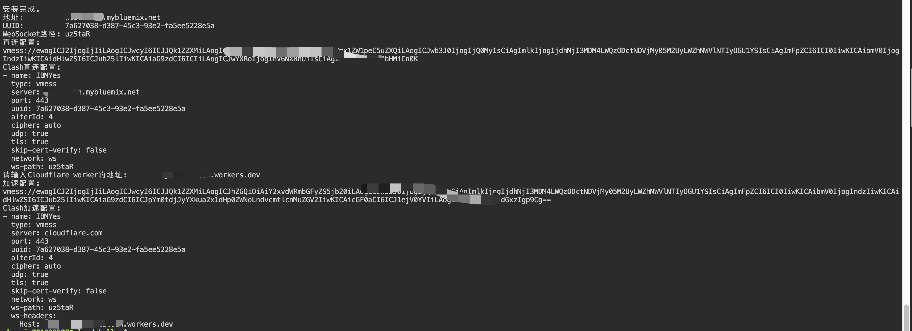

# IBMYes

IBM Cloud: https://cloud.ibm.com/

安装脚本
```shell
curl -LO https://github.com/chenmin1992/IBMYes/raw/master/install.sh && bash install.sh
```

本脚本经过优化, 去掉很多步骤, 注册完账号直接进入云命令行搭建

搭建期间只需输入一个纯英文小写字母的名字即可

搭建完了会生成现成的配置链接和Clash配置, 不需要自己改来改去

如果配置了Cloudflare加速可以在最后输入自己worker的地址, 会帮你自动生成套了Cloudflare的配置, 不需要自己改来改去



自动重启的部分没测, 我写在服务器定时任务了, 想用的可以自己测一下

可以配合原教程研究一下 [README-old.md](https://github.com/chenmin1992/IBMYes/blob/master/README-old.md)
